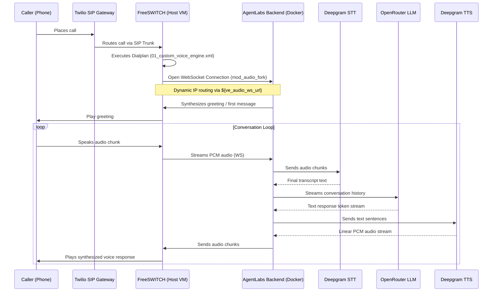

# Custom Voice Engine: Server Setup & Configuration Guide

This guide provides detailed instructions to install, configure, and debug the **Custom Voice Engine** plugin powered by **FreeSWITCH** and **AgentLabs**.

---

## 1. System Architecture

The Custom Voice Engine handles real-time, bi-directional voice streams with low latency using the following pipeline:



---

## 2. FreeSWITCH Server Setup

### A. Core Installation & Configuration (Docker)
FreeSWITCH can be built using the provided `Dockerfile.freeswitch` inside the plugin's `docker/` directory, which automatically compiles `mod_audio_fork` and handles all configurations.

### B. Native VM Installation & Compilation (Ubuntu 24.04 / Debian)
If you are deploying FreeSWITCH directly on a VM without Docker, follow these steps to compile FreeSWITCH along with its required custom modules:

#### Step 1: Install System Dependencies
Install core build tools and dependencies. On newer distributions like Ubuntu 24.04, `unixodbc-dev` is required for database support, and `nasm`/`yasm` are required for video codecs:
```bash
sudo apt-get update && sudo apt-get install -y \
    build-essential cmake git ca-certificates wget \
    autoconf automake libtool m4 pkg-config \
    libssl-dev libedit-dev libsqlite3-dev libcurl4-openssl-dev \
    libspeex-dev libspeexdsp-dev libopus-dev libsndfile1-dev \
    liblua5.2-dev uuid-dev zlib1g-dev \
    libjpeg-dev libpng-dev libtiff-dev \
    libwebsockets-dev python3-dev libasound2-dev \
    libogg-dev libvorbis-dev libshout3-dev libmpg123-dev \
    unixodbc-dev nasm yasm libldns-dev
```

#### Step 2: Compile Legacy PCRE1 from Source
Ubuntu 24.04 deprecates `pcre1` in favor of `pcre2`, but FreeSWITCH 1.10.x requires `pcre1` (`libpcre`). Compile it from source:
```bash
mkdir -p ~/freeswitch-build
cd ~/freeswitch-build
wget https://ftp.exim.org/pub/pcre/pcre-8.45.tar.gz
tar -xvf pcre-8.45.tar.gz
cd pcre-8.45
./configure --prefix=/usr --enable-utf8 --enable-unicode-properties
make -j$(nproc)
sudo make install
```

#### Step 3: Compile Required Telephony Libraries
FreeSWITCH 1.10+ requires separate compilation of Sofia-SIP and SpanDSP:

**Build Sofia-SIP:**
```bash
cd ~/freeswitch-build
git clone https://github.com/freeswitch/sofia-sip.git
cd sofia-sip
./bootstrap.sh
./configure
make -j$(nproc)
sudo make install
```

**Build SpanDSP:**
```bash
cd ~/freeswitch-build
git clone https://github.com/freeswitch/spandsp.git
cd spandsp
./bootstrap.sh
./configure
make -j$(nproc)
sudo make install
```

#### Step 4: Build FreeSWITCH with `mod_audio_fork`
Clone FreeSWITCH, copy the `mod_audio_fork` module source files, apply linkage and Makefile patches, and compile:

**1. Clone FreeSWITCH and copy the module source:**
```bash
cd ~/freeswitch-build
git clone --depth 1 -b v1.10.12 https://github.com/signalwire/freeswitch.git
cd freeswitch

# Clone the public community-maintained modules repository
git clone --depth 1 https://github.com/dochong/drachtio-freeswitch-modules.git ~/freeswitch-build/drachtio-modules
cp -r ~/freeswitch-build/drachtio-modules/modules/mod_audio_fork src/mod/applications/mod_audio_fork

# Enable the module in compilation configuration
sed -i 's/#applications\/mod_audio_fork/applications\/mod_audio_fork/' modules.conf || echo "applications/mod_audio_fork" >> modules.conf

# Disable mod_verto and mod_signalwire to avoid SignalWire dependency errors (libks)
sed -i 's/endpoints\/mod_verto/#endpoints\/mod_verto/' modules.conf
sed -i 's/applications\/mod_signalwire/#applications\/mod_signalwire/' modules.conf
```

**2. Patch Name-Mangled Linkage (`lws_glue.h`):**
Open `src/mod/applications/mod_audio_fork/lws_glue.h` and wrap declarations in `extern "C"` and correct the function signature:
```cpp
#ifndef __LWS_GLUE_H__
#define __LWS_GLUE_H__

#include "mod_audio_fork.h"

#ifdef __cplusplus
extern "C" {
#endif

int parse_ws_uri(const char* szServerUri, char* host, char *path, unsigned int* pPort, int* pSslFlags);

switch_status_t fork_init();
switch_status_t fork_cleanup();
switch_status_t fork_session_init(switch_core_session_t *session,
                uint32_t samples_per_second, char *host, unsigned int port, char* path, int sampling, int sslFlags, int channels, char* metadata, void **ppUserData);
switch_status_t fork_session_cleanup(switch_core_session_t *session);
switch_bool_t fork_frame(switch_media_bug_t *bug, void* user_data);
switch_status_t fork_service_thread(int *pRunning);

#ifdef __cplusplus
}
#endif

#endif
```

**3. Patch the Static Makefile (`Makefile`):**
Open `src/mod/applications/mod_audio_fork/Makefile` and define `LOCAL_OBJS`, C++ compiler standards, and runtime dependencies so both C/C++ files are linked correctly:
```makefile
MODNAME=mod_audio_fork
LOCAL_OBJS=lws_glue.o
LOCAL_LDFLAGS=`pkg-config --libs libwebsockets` -lstdc++
LOCAL_CXXFLAGS=-std=c++11

BASE=../../../..
include $(BASE)/build/modmake.rules
```

**4. Patch DNS and Buffer Overflow Bugs (`mod_audio_fork.h` & `lws_glue.cpp`):**
To prevent `dns lookup failed -5` errors on localhost connections and fix a 1-byte stack overflow that corrupts the parsed hostname:

* **Add release variables to `mod_audio_fork.h`:**
  Open `src/mod/applications/mod_audio_fork/mod_audio_fork.h` and insert these two fields inside the `struct cap_cb` definition (right before `struct lws_per_vhost_data* vhd;`):
  ```c
    int session_released;
    int connection_released;
  ```

* **Replace `parse_ws_uri` in `lws_glue.cpp`:**
  Open `src/mod/applications/mod_audio_fork/lws_glue.cpp`, find the `parse_ws_uri` function, and replace its body with the following robust C++ string parser:
  ```cpp
  int parse_ws_uri(const char* szServerUri, char* host, char *path, unsigned int* pPort, int* pSslFlags) {
    std::string uri(szServerUri);

    // Parse scheme
    std::string scheme;
    size_t scheme_end = uri.find("://");
    if (scheme_end == std::string::npos) {
      return 0;
    }
    scheme = uri.substr(0, scheme_end);

    // Validate scheme
    if (scheme == "ws" || scheme == "WS" || scheme == "http" || scheme == "HTTP") {
      *pSslFlags = 0;
      *pPort = 80;
    } else if (scheme == "wss" || scheme == "WSS" || scheme == "https" || scheme == "HTTPS") {
      *pSslFlags = LCCSCF_USE_SSL | LCCSCF_ALLOW_SELFSIGNED;
      *pPort = 443;
    } else {
      return 0;
    }

    std::string rest = uri.substr(scheme_end + 3);

    // Find path start
    size_t path_start = rest.find('/');
    std::string host_port;
    if (path_start == std::string::npos) {
      host_port = rest;
      strcpy(path, "/");
    } else {
      host_port = rest.substr(0, path_start);
      std::string path_str = rest.substr(path_start);
      strncpy(path, path_str.c_str(), MAX_PATH_LEN - 1);
      path[MAX_PATH_LEN - 1] = '\0';
    }

    // Parse host and port
    size_t colon = host_port.find(':');
    if (colon == std::string::npos) {
      strncpy(host, host_port.c_str(), MAX_WS_URL_LEN - 1);
      host[MAX_WS_URL_LEN - 1] = '\0';
    } else {
      std::string host_str = host_port.substr(0, colon);
      std::string port_str = host_port.substr(colon + 1);
      strncpy(host, host_str.c_str(), MAX_WS_URL_LEN - 1);
      host[MAX_WS_URL_LEN - 1] = '\0';
      *pPort = atoi(port_str.c_str());
    }

    return 1;
  }
  ```

**5. Generate build configuration, Compile, and Install:**
```bash
# Generate build configuration
./bootstrap.sh -j
./configure --prefix=/usr/local/freeswitch --enable-core-odbc-support CFLAGS="-Wno-error" CXXFLAGS="-Wno-error"

# Compile and Install
make CFLAGS="-Wno-error" CXXFLAGS="-Wno-error" -j$(nproc)
sudo make install

# Install configurations, sounds, and music-on-hold
sudo make samples
sudo mkdir -p /usr/local/freeswitch/share/freeswitch/sounds/music
sudo make sounds-install
sudo make moh-install

# Update shared library cache
sudo ldconfig
```


### C. AWS / Firewall Inbound Rules Configuration
If your FreeSWITCH instance is deployed on AWS EC2 (or another cloud provider behind a firewall/security group), you **must** configure the following inbound security rules to allow SIP signaling, web console connections, and RTP media traffic:

| Type | Protocol | Port Range | Source | Description |
|---|---|---|---|---|
| Custom UDP | UDP | `5060` | `0.0.0.0/0` | SIP Signaling (Internal Profile / Default SIP Port) |
| Custom UDP | UDP | `5080` | `0.0.0.0/0` | SIP Signaling (External Profile / Gateway Trunking) |
| Custom UDP | UDP | `16384 - 32768` | `0.0.0.0/0` | RTP Audio/Media Streams (FreeSWITCH media range) |
| SSH | TCP | `22` | `0.0.0.0/0` or Your IP | SSH Remote Shell Access |
| HTTP | TCP | `80` | `0.0.0.0/0` | HTTP Web Traffic (Optional / Let's Encrypt) |
| HTTPS | TCP | `443` | `0.0.0.0/0` | HTTPS Web Traffic / Secure WebSockets |

> [!IMPORTANT]
> Make sure to open the RTP port range `16384-32768` on UDP. If these ports are blocked, your calls will connect but you will hear **dead silence (no audio)** because the audio packet streams (RTP) cannot traverse the firewall.


### D. Core FreeSWITCH Configurations

1. **Verify Config Locations:**
   - Configuration Directory: `/usr/local/freeswitch/etc/freeswitch/`
   - Dialplan Directory: `/usr/local/freeswitch/etc/freeswitch/dialplan/public/`
   - SIP Profiles Directory: `/usr/local/freeswitch/etc/freeswitch/sip_profiles/`
   - Log Directory: `/usr/local/freeswitch/var/log/freeswitch/`

2. **Enable Event Socket Library (ESL):**
   Ensure that `/usr/local/freeswitch/etc/freeswitch/autoload_configs/event_socket.conf.xml` has `listen-ip` set to `0.0.0.0` to accept connections, and secures it by using the built-in `loopback.auto` ACL to prevent unauthorized connection drops:
   ```xml
   <configuration name="event_socket.conf" description="Socket Endpoint">
     <settings>
       <param name="listen-ip" value="0.0.0.0"/>
       <param name="listen-port" value="8021"/>
       <param name="password" value="ClueCon"/>
       <!-- Restrict connection to local machine for security -->
       <param name="apply-inbound-acl" value="loopback.auto"/>
     </settings>
   </configuration>
   ```

3. **Load `mod_audio_fork`:**
   Load the module inside `/usr/local/freeswitch/etc/freeswitch/autoload_configs/modules.conf.xml`:
   ```xml
   <load module="mod_audio_fork"/>
   ```

---

## 3. Dynamic IP & Dialplan Setup

Because the AgentLabs Node.js server runs inside a Docker container, its internal IP address (e.g., `10.0.1.x`) changes every time the container is rebuilt or redeployed. 

To prevent connection failures, we use a **dynamic variable routing mechanism** instead of hardcoded IPs.

### Step 1: Create the Dialplan XML
Write the following XML file to `/usr/local/freeswitch/etc/freeswitch/dialplan/public/01_custom_voice_engine.xml` on the VM:

```xml
<extension name="ai_voice_agent">
  <condition field="destination_number" expression="^(\+?\d+)$">
    <action application="answer"/>
    <action application="playback" data="silence_stream://500"/>
    <action application="set" data="tts_engine=flite"/>
    <action application="set" data="tts_voice=slt"/>
    <!-- Streams audio directly to the dynamic Node.js Docker container WebSocket URL -->
    <action application="set" data="dummy_fork=${uuid_audio_fork(${uuid} start ${ve_audio_ws_url}/${uuid} mono 8k)}"/>
    <action application="park"/>
  </condition>
</extension>
```

Apply the new dialplan config:
```bash
fs_cli -x "reloadxml"
```

### Step 2: Dynamic IP Broadcast (Automatic)
The AgentLabs plugin has built-in auto-discovery:
1. On container startup, the plugin detects its internal container bridge IP (e.g., `10.0.1.14`) via `os.networkInterfaces()`.
2. It establishes an ESL connection to all registered online FreeSWITCH nodes.
3. It executes `global_setvar ve_audio_ws_url ws://<IP>:3006/voice-engine/ws/audio` dynamically.
4. **Fallback:** For outbound tests, the IP is also passed as an originate channel variable.

---

## 4. Web Application Configurations

### A. Provider API Keys
Global provider credentials must be set in the Admin Panel or written directly to the database. These keys are stored in `global_settings`:

| Key Name | Description | Required Provider |
|---|---|---|
| `ve_stt_active_provider` | Active speech-to-text provider | `deepgram` or `sarvam` |
| `ve_deepgram_api_key` | Deepgram Token key | Deepgram (STT / TTS) |
| `ve_openrouter_api_key` | OpenRouter authorization token | OpenRouter (LLM) |
| `ve_llm_default_model` | Default AI model used | e.g. `openai/gpt-4o-mini` |

### B. Plugin Compilation
Whenever modifying plugin files, you must rebuild the bundle:
```bash
npx esbuild plugins/custom-voice-engine/index.ts --platform=node --packages=external --bundle --format=esm --outfile=plugins/custom-voice-engine/index.js
```

---

## 5. Troubleshooting & Operations

### Useful CLI Command Checklist

* **Check registered SIP gateways:**
  ```bash
  fs_cli -x "sofia status"
  ```
* **Manually set/override the WebSocket IP (for debugging):**
  ```bash
  fs_cli -x "global_setvar ve_audio_ws_url ws://<CONTAINER_IP>:3006/voice-engine/ws/audio"
  ```
* **Monitor active sessions and calls in real-time:**
  ```bash
  fs_cli -x "show calls"
  ```
* **Tail active FreeSWITCH log file:**
  ```bash
  tail -f /usr/local/freeswitch/var/log/freeswitch/freeswitch.log
  ```
* **Watch Docker container logs:**
  ```bash
  docker logs -f <container_id> --tail 50
  ```

### Common Build & Compilation Errors

* **Error: `You need to either install libldns-dev or disable mod_enum in modules.conf`**
  This happens when the DNS/enum library required for SIP lookup features is missing.
  **Fix:** Install the dependency on the host system:
  ```bash
  sudo apt-get install -y libldns-dev
  ```
  Then, re-run `./configure` and `make`.

* **Error: `make: *** No targets specified and no makefile found. Stop.`**
  This occurs when the previous `./configure` step failed or was skipped, meaning the `Makefile` was never generated.
  **Fix:** Look at the `./configure` command output for any errors or missing packages, install them, and make sure `./configure` finishes successfully before running `make`.

* **Error: `You need to either install libks2 or libks or disable mod_verto in modules.conf`**
  This occurs because FreeSWITCH's default configuration tries to build `mod_verto` and `mod_signalwire`, which require SignalWire's custom `libks` library. Since our custom engine only relies on `mod_audio_fork`, these modules are not required.
  **Fix:** Comment out these modules in `modules.conf` from the root of your FreeSWITCH build directory:
  ```bash
  sed -i 's/endpoints\/mod_verto/#endpoints\/mod_verto/' modules.conf
  sed -i 's/applications\/mod_signalwire/#applications\/mod_signalwire/' modules.conf
  ```
  After that, re-run `./configure` and `make`.

### Network, Firewall & Routing Issues

* **Error: Plivo/Carrier Incoming Calls Time Out ("Receiver Timeout")**
  If incoming calls do not show up in the FreeSWITCH logs and the carrier times out, check the following:
  1. **Firewall Port 5080 UDP:** Inbound calls from public carriers hit the FreeSWITCH `external` SIP profile which listens on port `5080` (UDP) by default. Ensure this port is open in your cloud provider's Security Group and VM firewall:
     ```bash
     sudo ufw allow 5080/udp
     ```
  2. **Plivo/Carrier Inbound SIP Routing:** Since persistent registration is turned off (`register=false`) to avoid Plivo gateway registration loops, you must configure the inbound routing destination inside your carrier console using a direct SIP URI pointing to your VM's public IP on port `5080`:
     ```txt
     sip:incoming@<YOUR_VM_PUBLIC_IP>:5080
     ```

* **Error: `mod_audio_fork` Websocket URL resolves to empty / fails to parse**
  This happens if FreeSWITCH reloads its configuration and wipes out dynamic variable values from memory.
  **Fix:** Make the `ve_audio_ws_url` variable persistent. Add this line inside `/usr/local/freeswitch/etc/freeswitch/vars.xml`:
  ```xml
  <X-PRE-PROCESS cmd="set" data="ve_audio_ws_url=ws://<YOUR_VM_PUBLIC_IP>:<BACKEND_PORT>/voice-engine/ws/audio"/>
  ```
  Then reference it in your dialplan file (`01_custom_voice_engine.xml`) using the double `$` syntax:
  ```xml
  <action application="set" data="dummy_fork=${uuid_audio_fork(${uuid} start $${ve_audio_ws_url}/${uuid} mono 8k)}"/>
  ```
  And reload configuration:
  ```bash
  /usr/local/freeswitch/bin/fs_cli -x "reloadxml"
  ```

---


## 6. Database Verification Queries

If a call connects but hangs up immediately, check the session status and metadata:

```sql
-- View latest custom voice session
SELECT id, status, duration_seconds, transcript, metadata 
FROM ve_sessions 
ORDER BY created_at DESC 
LIMIT 1;

-- Check if the test agent exists in the agents table
SELECT id, name, telephony_provider, type 
FROM agents 
WHERE id = '<targetAgentId>';
```

---

## 7. Advanced Telephony & ESL Pipeline Implementation Notes

### A. ESL Protocol-Compliant Parser
The custom ESL connection parser is designed to handle FreeSWITCH text/event-plain streams robustly:
* **Content-Length Framing:** Instead of split-by-newline parsing (which breaks under large packets or binary structures), the parser extracts the `Content-Length` header of the envelope first, then reads exactly that many bytes from the buffer to construct the event body.
* **Nested Header Extraction:** After extracting the body block, it parses standard key-value headers (like `Event-Name`, `Channel-Call-UUID`) as well as URL-decoded parameters.

### B. Custom Event Subclass Subscription
By default, subscribing to `CUSTOM` in FreeSWITCH without specifying subclasses is invalid or registers no custom events. To receive the `mod_audio_fork::play_audio` events, the engine issues separate plain subscriptions:
1. Standard Channel Lifecycle: `event plain CHANNEL_CREATE CHANNEL_ANSWER CHANNEL_HANGUP CHANNEL_DESTROY`
2. Custom Media Playbacks: `event plain CUSTOM mod_audio_fork::play_audio`

### C. WebSocket Connection Flow & Greeting Synchronization
* **Deferred Initialization:** The `AudioSession` pipeline initialization is deferred until the WebSocket connection from `mod_audio_fork` is fully established. This ensures that when the welcome/first message is synthesized, the WebSocket is active, and the `onAudioOut` callback is registered, preventing greeting audio loss.
* **Handshake Constraints:** FreeSWITCH's `mod_audio_fork` client operates as a pure binary stream and does not accept JSON ready handshakes (e.g., `{"type": "ready"}`). The server bypasses unnecessary handshake frames to avoid client-side protocol errors.

